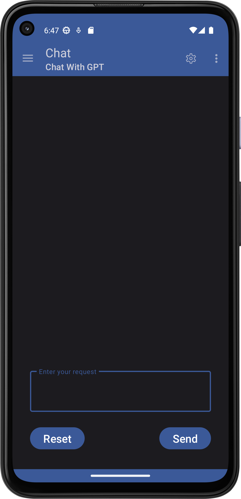
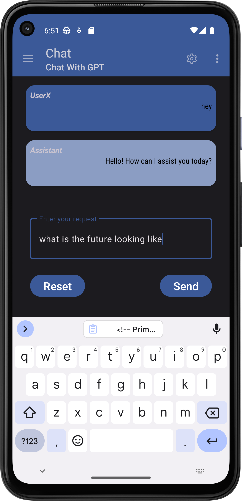
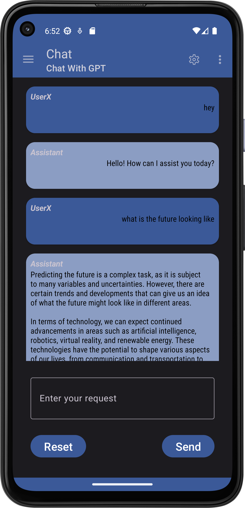
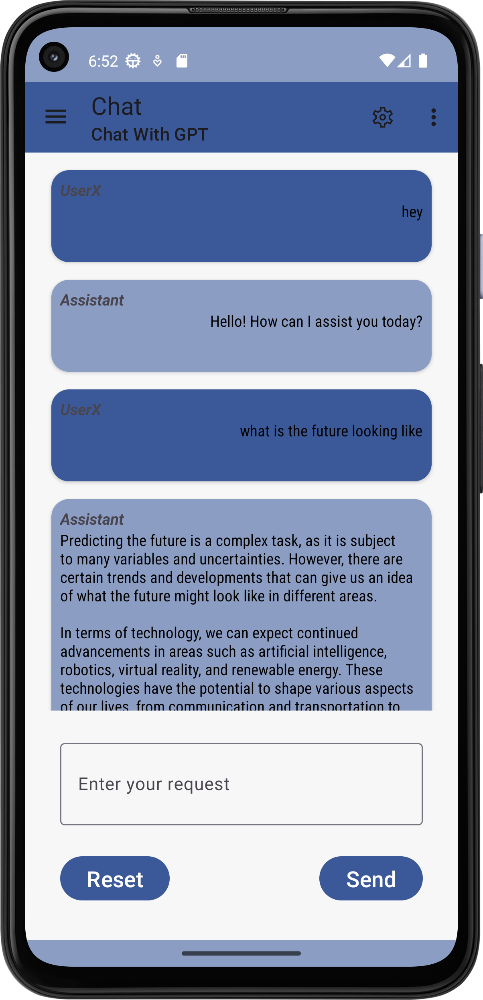
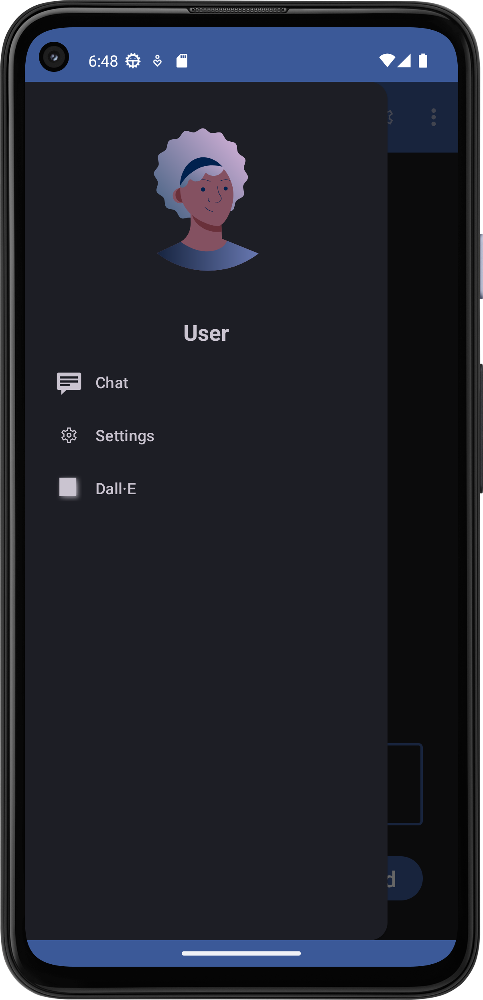
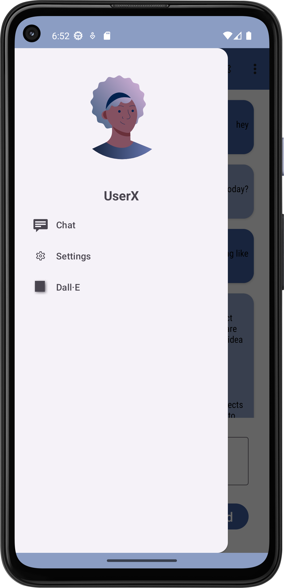
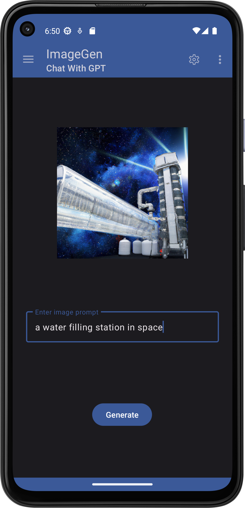
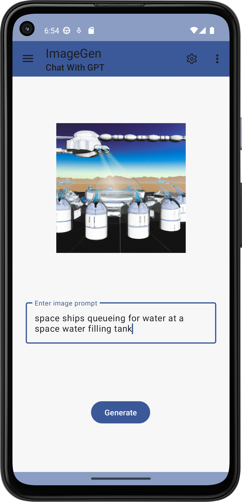
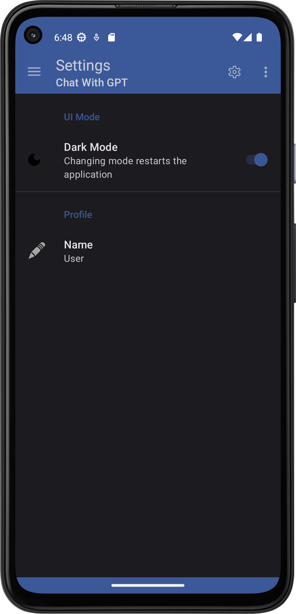
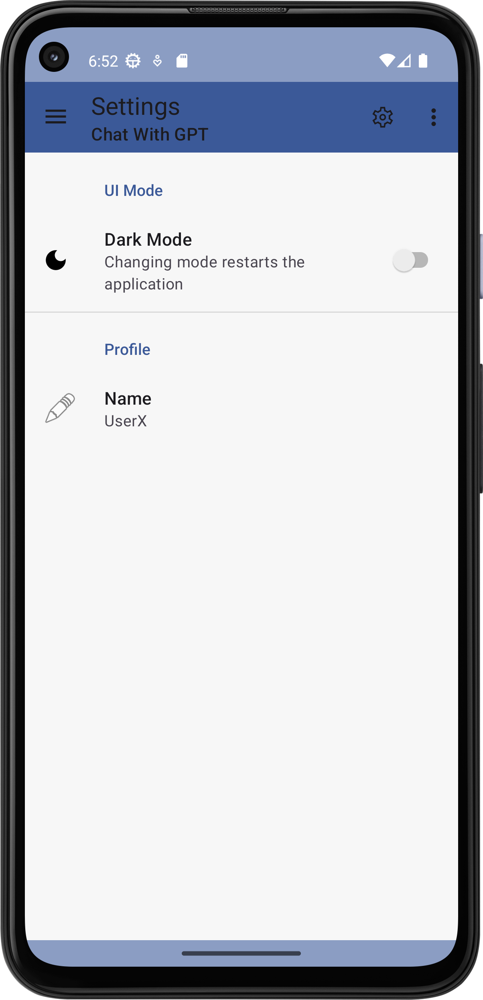

# Chat With GPT
GPT Android FrontEnd  
Usage via android studio will require that you enter own api key in the main file in order to talk to the Open AI API

### Demo video
[Youtube Demo](https://youtu.be/FVcP1DqXoGE)

*This project is partly an experiment, as such, development is ongoing*

## Use cases  

1. User can send and receive messages to and from gpt assistant using the *Chat screen*
2. User can change their custom name using the *Settings screen*
3. User can alternate between dark mode and light mode using the *Settings screen*
4. User can prompt for a dall-e generated image using the *Dall-E screen*
5. User can save Dall-E generated image using context menu in the *Dall-E screen*.

## Installer
[Click here to install to android](https://github.com/teboho/chatgpt-client/releases)

## Screenshots

   

   

   

   

   

> Github: [@teboho/chatpt-client](https://github.com/teboho/chatgpt-client)  
> &copy; 2023 teboho  
> Using icons from https://dribbble.com/shots/8934409-Diversity-Avatars  
