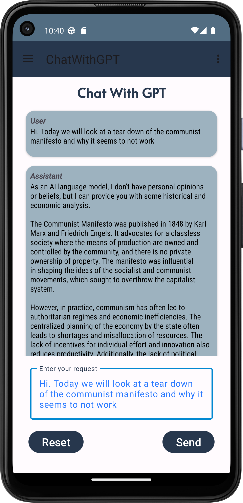
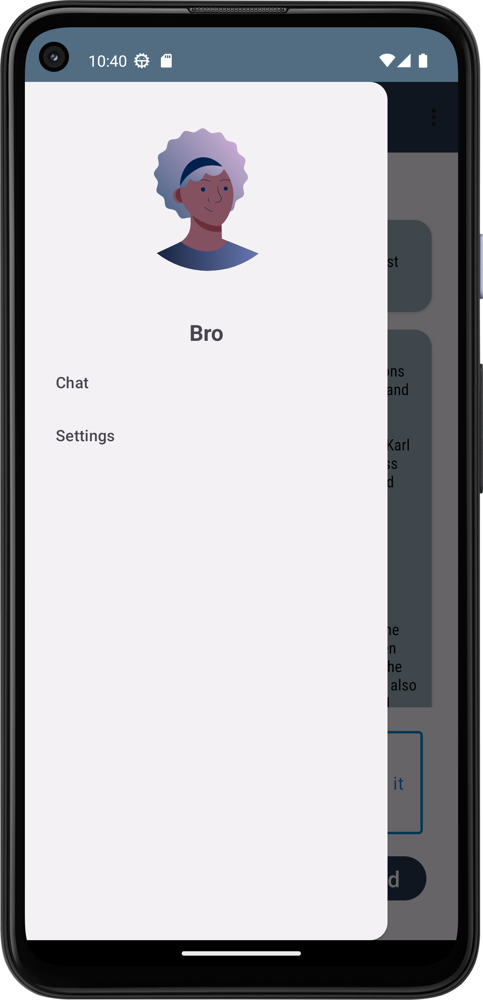
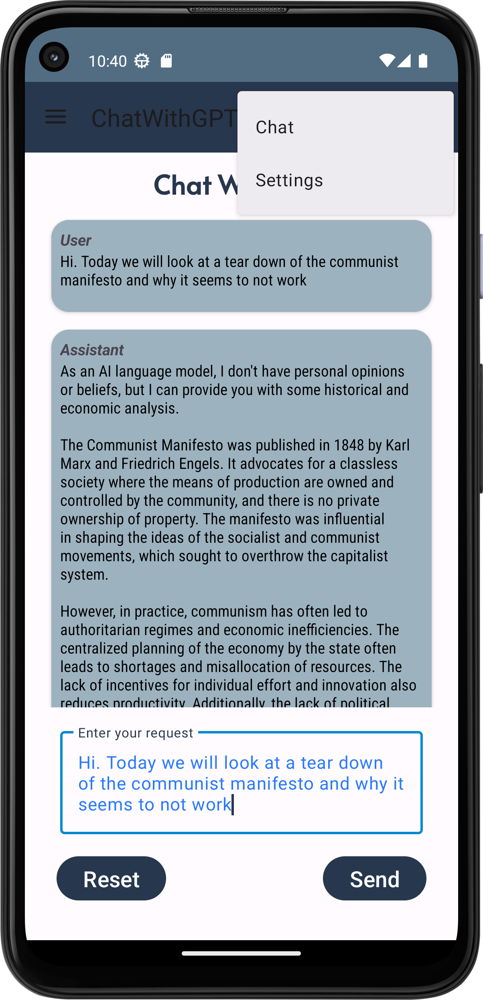
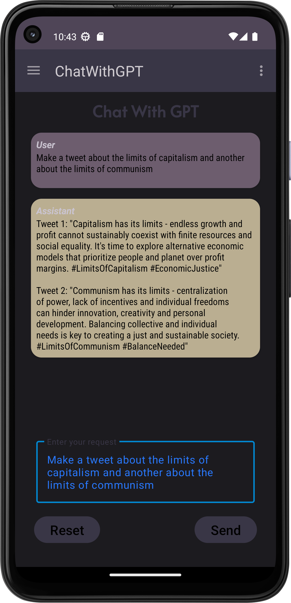

# Chat With GPT
GPT Android FrontEnd  
Usage via android studio will require that you enter own api key in the main file in order to talk to the Open AI API

*This project is partly an experiment, as such, development is ongoing*

### Installer
[Click here to install to android](https://github.com/teboho/chatgpt-client/releases/download/installer/app-debug.apk)

## Screenshots

   

   

> Github: [@teboho/chatpt-client](https://github.com/teboho/chatgpt-client)  
> &copy; 2023 teboho  
> Using icons from https://dribbble.com/shots/8934409-Diversity-Avatars  
